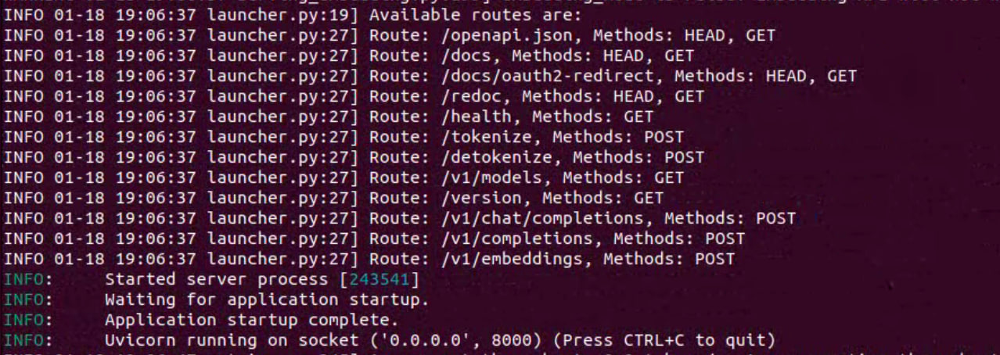
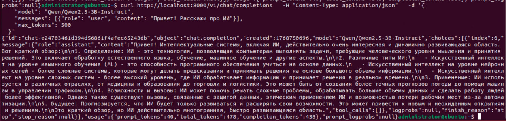
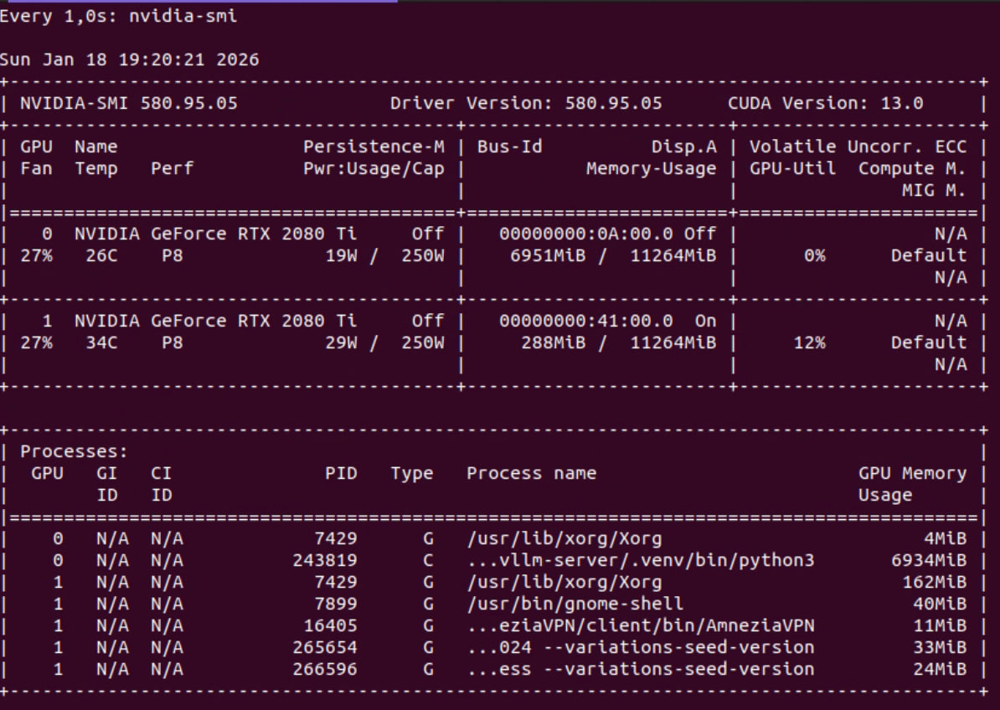
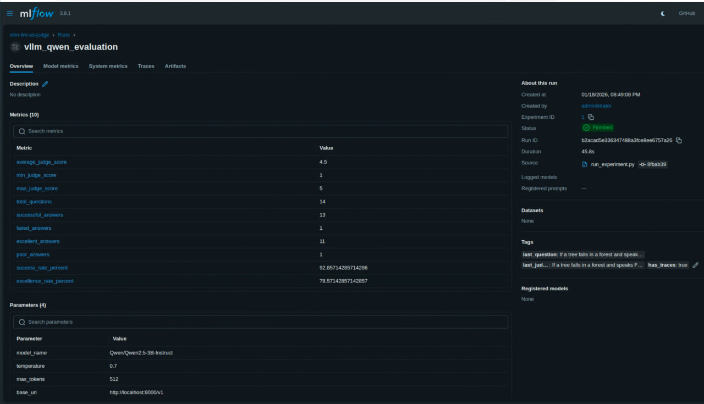
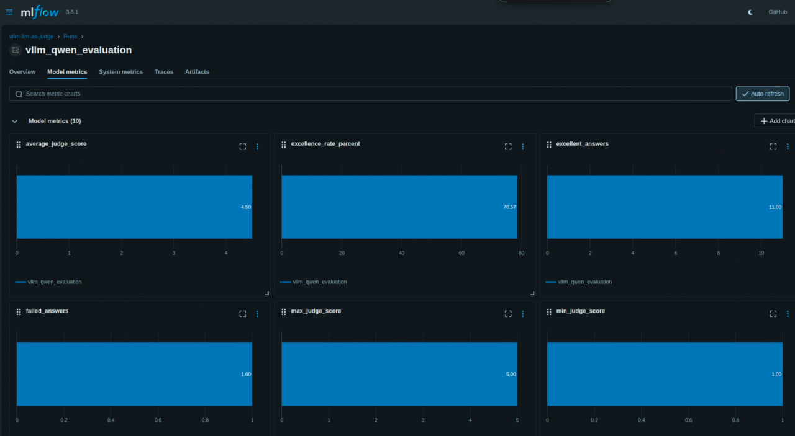
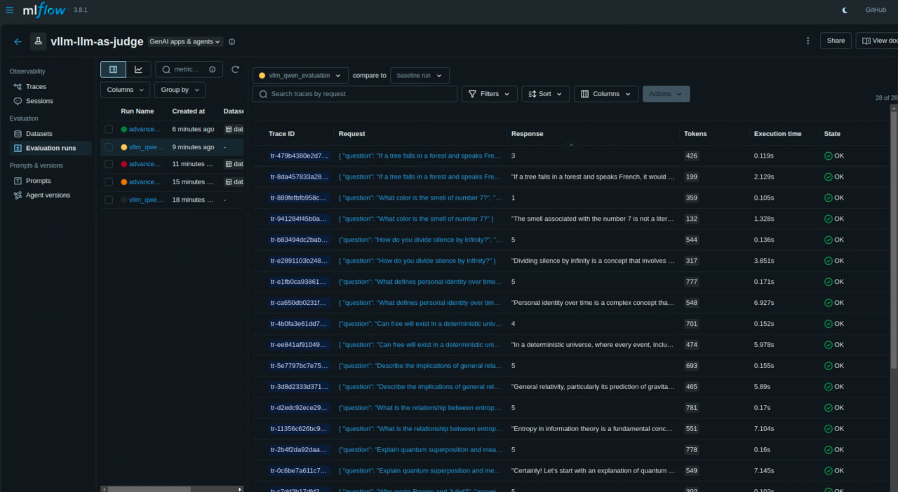

# Отчёт по ДЗ-3

## vLLM

### 1) `vllm-1.jpg` — запуск vLLM
Запуск сервера модели:

```
vllm serve Qwen/Qwen2.5-3B-Instruct \
  --gpu-memory-utilization 0.8 \
  --max-model-len 1024 \
  --dtype float16 \
  --host 0.0.0.0 \
  --port 8000
```



### 2) `vllm-2.jpg` — пример запроса/ответа через OpenAI-совместимый API (curl)
Пример запроса:

```
curl http://localhost:8000/v1/chat/completions \
  -H "Content-Type: application/json" \
  -d '{
    "model": "Qwen/Qwen2.5-3B-Instruct",
    "messages": [{"role": "user", "content": "Привет! Расскажи про ИИ"}],
    "max_tokens": 500
  }'
```

На скриншоте виден корректный ответ от модели.



### 3) `vllm-3.jpg` — нагрузка GPU
Пример вывода `nvidia-smi` с загрузкой GPU (RTX 2080) во время инференса.



## MLflow (базовый эксперимент)

### `base-metrics-1.jpg` — общая информация по эксперименту
Общий обзор эксперимента и запусков (runs): список run'ов, базовые поля (дата/статус) и контекст эксперимента.



### `base-metrics-2.jpg` — метрики (графики)
Визуализация метрик базового эксперимента в виде графиков (средняя/минимальная/максимальная оценка судьи и др.).



### `base-metrics-3.jpg` — трейсы (вопросы → ответы → оценки)
Traces: для каждого запроса видно вход (вопрос), выход (ответ модели) и результат оценки (LLM-as-a-Judge).



## Выводы и результаты эксперимента (по критериям проверки)

Ниже — краткое резюме по критериям оценки и фактические результаты запуска в MLflow.

### 1) Корректность запуска и настройки vLLM-сервера
- Сервер vLLM успешно поднят и доступен по адресу `http://localhost:8000`.
- Использована команда запуска (см. `vllm-1.jpg`).
- OpenAI-совместимый endpoint `/v1/chat/completions` отрабатывает корректно (см. `vllm-2.jpg`).

### 2) Настройка MLflow Deployments и интеграция с моделью
- Инференс и оценка логируются в MLflow (SQLite backend `mlflow.db`).
- В эксперименте фиксируются параметры запуска (`model_name`, `temperature`, `max_tokens`, `base_url`) и метрики качества.
- Трейсы запросов/ответов видны во вкладке Traces (см. `base-metrics-3.jpg`).

### 3) Качество и адекватность кастомной метрики LLM-as-a-Judge
- Реализована простая шкала оценки **1–5**: модель-судья оценивает качество ответа на каждый вопрос.
- Grading prompt сделан «строгим»: 5 ставится только за полный/точный ответ, краткие или поверхностные ответы получают более низкий балл.
- Логика шкалы понятна и интерпретируема: итоговая метрика агрегируется по датасету.

### 4) Использование модели через API (requests/OpenAI client)
- Использован OpenAI-совместимый API vLLM (пример curl — `vllm-2.jpg`).
- В проекте также присутствуют проверки/примеры вызовов через `requests/httpx/openai` (см. команды `make test`).

### 5) Анализ и интерпретация результата
Как работает оценка:
- На каждый вопрос генерируется ответ модели.
- Затем модель (как судья) ставит оценку 1–5.
- Далее в MLflow логируются результатм.

Что видно по результатам:
- Средняя оценка **4.43/5** говорит, что на данном наборе из 14 вопросов модель в основном отвечает корректно.
- Минимальная оценка **3** показывает, что на части вопросов ответы были неполными/слишком общими.

### 6) Дополнительная задача: chat template
- Использована **Qwen/Qwen2.5-3B-Instruct**, которая корректно поддерживает чат-формат (`messages` с ролями `user/system`) и совместима с `/v1/chat/completions`.

---

## Результаты MLflow run `vllm_qwen_evaluation`

**Run:** `vllm_qwen_evaluation`  
**Run ID:** `b0ea23b32767433d8bea8879d61a3c2b`  
**Источник:** `run_experiment.py`  
**Статус:** Finished  
**Длительность:** ~47s  

### Параметры
- `model_name`: `Qwen/Qwen2.5-3B-Instruct`
- `temperature`: `0.7`
- `max_tokens`: `512`
- `base_url`: `http://localhost:8000/v1`

### Метрики
- `average_judge_score`: **4.428571428571429**
- `min_judge_score`: **3**
- `max_judge_score`: **5**
- `total_questions`: **14**
