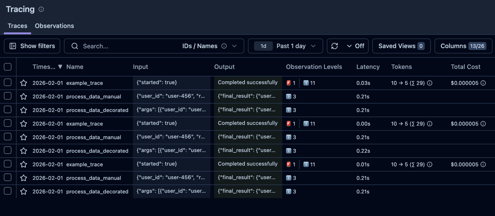
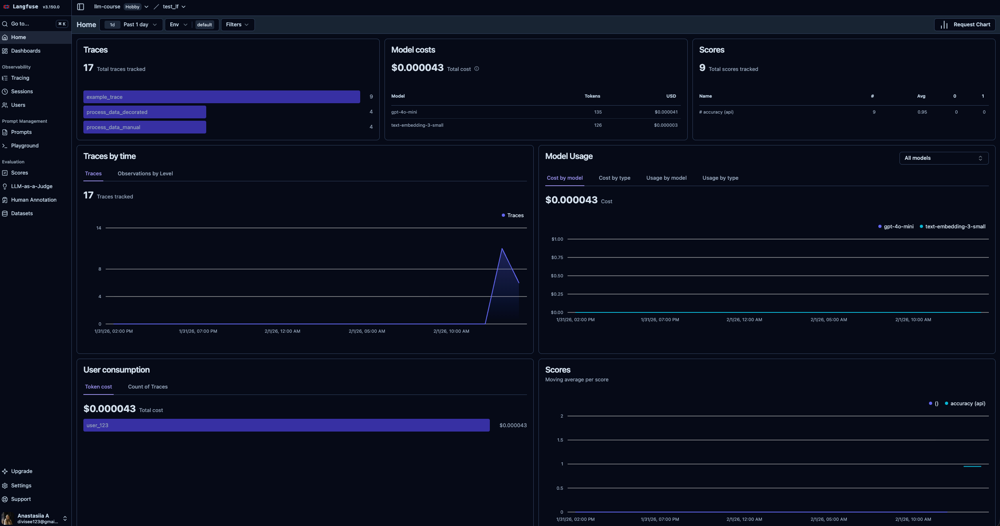
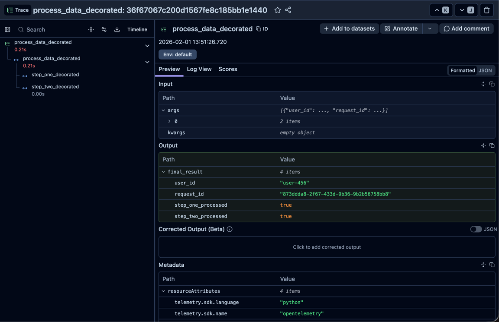
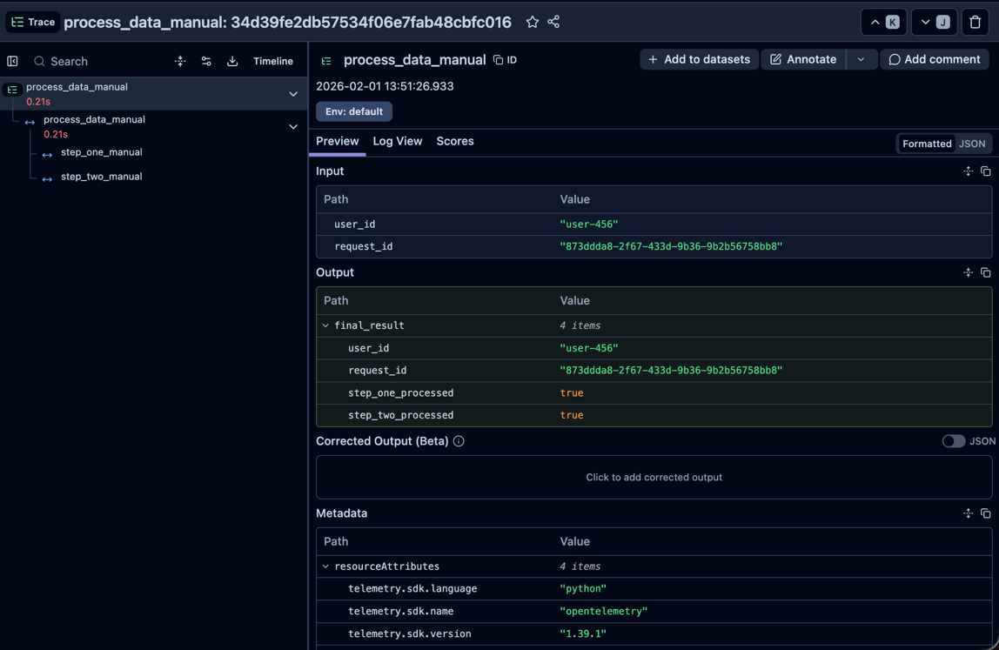
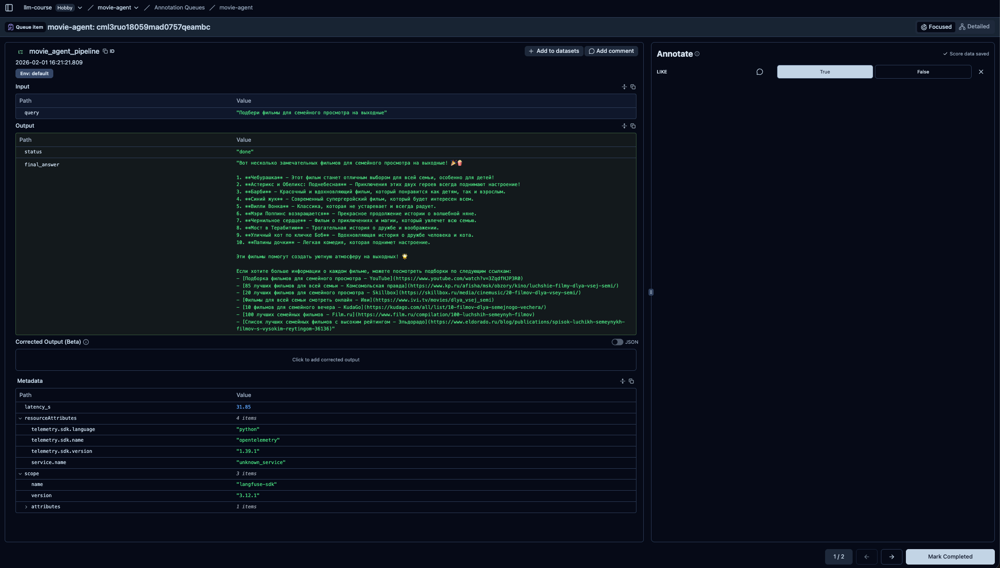
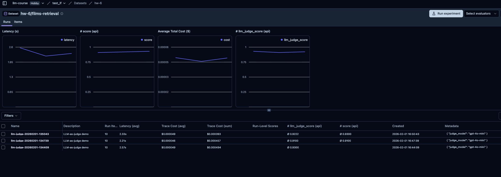

# Langfuse Demo

Демо с экспериментами по трассировке в Langfuse: полный набор типов наблюдений, запуск через декоратор и ручное логирование без декоратора.

## Настройка

1. Установите зависимости:

   ```bash
   pip install -r requirements.txt
   ```

2. Создайте файл `hw-5/.env` и заполните переменные окружения:

   ```dotenv
   LANGFUSE_SECRET_KEY=sk-lf-...
   LANGFUSE_PUBLIC_KEY=pk-lf-...
   LANGFUSE_BASE_URL=https://cloud.langfuse.com
   ```

3. Запустите нужный эксперимент:

   ```bash
   python demo.py
   python demo_observe.py
   ```
Общий список трейсов после запуска экспериментов:



Начальная страница Langfuse (дашборд с графиками и диаграммами - трейсов, цен и scores):



## Эксперимент 1: полный набор типов наблюдений

Файл: `hw-5/demo.py`

Сценарий создает один root span и вложенные наблюдения всех доступных типов, включая generation, embedding, agent, tool, retriever, guardrail и ошибки. Скриншот показывает развернутый трейс с таймлайном и статусами.

Примеры нескольких вызовов:

```python
langfuse = get_client()

with langfuse.start_as_current_observation(
    as_type="span",
    name="example_trace",
    input={"started": True},
) as root:
    with root.start_as_current_observation(
        as_type="agent",
        name="planner_agent",
        input={"goal": "Find capital of France"},
    ) as agent_span:
        agent_span.update(output={"status": "completed"})

    with root.start_as_current_observation(
        as_type="tool",
        name="wiki_search",
        input={"query": "capital of France"},
    ) as tool_span:
        tool_span.update(output={"hits": 3})

    with root.start_as_current_observation(
        as_type="generation",
        name="llm_call",
        model="gpt-4o-mini",
        model_parameters={"temperature": "0.7"},
        input={"prompt": "What is the capital of France?"},
    ) as gen:
        gen.update(
            output="The capital of France is Paris.",
            usage_details={
                "prompt_tokens": 10,
                "completion_tokens": 5,
                "total_tokens": 15,
            },
        )

    with root.start_as_current_observation(
        as_type="span",
        name="error_occurred",
        level="ERROR",
        status_message="Connection timeout",
        metadata={"error": "Connection timeout", "code": 500},
    ) as error_span:
        error_span.update(output={"retry": False})
```


Наиболее информативным выглядит такой принцип логирования, т.к. одном трейсе показаны все ключевые типы наблюдений (generation, embedding, agent, tool, retriever, guardrail), есть успешные и ошибочные ветки, а также таймлайн по шагам. Это дает наиболее полную картину поведения пайплайна и взаимодействия агентов и последовательность вызовов.

## Эксперимент 2: декоратор @observe

Файл: `hw-5/demo_observe.py`

Сценарий демонстрирует трассировку функций через декоратор `@observe`. Трейс формируется автоматически, а вложенные шаги попадают в дерево.

Пример кода:

```python
from langfuse import observe

@observe(name="process_data_decorated")
def process_data_decorated(data):
    result1 = step_one_decorated(data)
    result2 = step_two_decorated(result1)
    return {"final_result": result2}

@observe(name="step_one_decorated")
def step_one_decorated(data):
    return {**data, "step_one_processed": True}

@observe(name="step_two_decorated")
def step_two_decorated(data):
    return {**data, "step_two_processed": True}
```



## Эксперимент 3: ручное логирование без декоратора

Файл: `hw-5/demo_observe.py`

Сценарий строит трейс вручную через `start_as_current_observation` и `update`. На скриншоте видно два шага, вложенные в root span.

Пример кода:

```python
def process_data_manual(data, trace_name, langfuse):
    with langfuse.start_as_current_observation(
        as_type="span",
        name=trace_name,
        input=data,
    ) as root_span:
        result1 = step_one_manual(data, langfuse)
        result2 = step_two_manual(result1, langfuse)
        root_span.update(output={"final_result": result2})
        return {"final_result": result2}

def step_one_manual(data, langfuse):
    with langfuse.start_as_current_observation(
        as_type="span",
        name="step_one_manual",
        input=data,
    ) as span:
        output = {**data, "step_one_processed": True}
        span.update(output=output)
        return output

def step_two_manual(data, langfuse):
    with langfuse.start_as_current_observation(
        as_type="span",
        name="step_two_manual",
        input=data,
    ) as span:
        output = {**data, "step_two_processed": True}
        span.update(output=output)
        return output
```



## Аннотации

Аннотации — это ручные метки качества (например, лайк/дизлайк), которые помогают собирать обратную связь, готовить данные для последующей разметки и дообучения, а также быстро оценивать качество ответов и шагов пайплайна.

В этом проекте добавлена аннотация типа boolean `LIKE` (0/1). Пример простановки аннотации:



Оценки можно ставить как из очереди аннотаций, так и прямо из дашборда со списком трейсов. Пример трейсов с оценками:


Скриншоты сделаны на пайплайне из [`hw-6`](../../hw-6).

## LLM-as-a-judge

Проведена оценка «LLM как судья»: скрипт `hw-5/llm_judge_demo.py` прогнал датасет и загрузил результаты в Langfuse.



Тестовый пример для демонстрации метрики. Для объективного теста нужно иметь переформулированные запросы и запускать все пайплайны (TODO).

## Вывод

В рамках работы подготовлены демо‑сценарии логирования, аннотаций и оценки (включая LLM‑as‑a‑judge), а также показаны примеры трейсинга и метрик. Langfuse используется как центральный инструмент наблюдаемости: он собирает трейсы, метрики и оценки, позволяет анализировать шаги пайплайна и качество ответов, а также поддерживает ручную разметку для последующего улучшения системы.

## Примечания

- `get_client()` использует переменные окружения `LANGFUSE_*`.
- Для короткоживущих скриптов важно вызывать `flush()` и `shutdown()`.

См. результаты в дашборде Langfuse: https://cloud.langfuse.com
