# Movie Agent — Мультиагентная система поиска и рекомендации фильмов

## Содержание

- [1) Установка и запуск компонентов](#1-установка-и-запуск-компонентов)
- [2) Подготовка данных](#2-подготовка-данных)
- [3) Архитектура пайплайна](#3-архитектура-пайплайна)
- [4) Логирование в Langfuse](#4-логирование-в-langfuse)
- [5) Примеры работы пайплайна](#5-примеры-работы-пайплайна)
- [6) API сервис и интеграция с Open WebUI](#6-api-сервис-и-интеграция-с-open-webui)
- [7) Эксперименты](#7-эксперименты)

## 1) Установка и запуск компонентов

### Сводная таблица компонентов

| Компонент | URL | Порт | Описание |
|-----------|-----|------|----------|
| **Qdrant** | http://localhost:6333/dashboard | 6333, 6334 | Векторная база данных для RAG-поиска по фильмам |
| **Ollama** | http://localhost:11434 | 11434 | Локальный инференс LLM и эмбеддингов |
| **Langfuse** | http://localhost:3001 | 3001 | Мониторинг и трекинг LLM-запросов |
| **Open WebUI** | http://localhost:3000 | 3000 | UI для общения с моделями и агентами |
| **Movie Agent API** | http://localhost:8000 | 8000 | Мультиагентный RAG-сервис для поиска фильмов |

### Ollama — инференс моделей и эмбеддингов

```bash
brew install ollama # MacOS
curl -fsSL https://ollama.com/install.sh | sh # Ubuntu
brew services start ollama    # или: ollama serve
ollama pull embeddinggemma
```

### Qdrant — векторный поиск для RAG

```bash
docker run -d \
  --name qdrant \
  -p 6333:6333 \
  -p 6334:6334 \
  -v qdrant_data:/qdrant/storage \
  --restart unless-stopped \
  qdrant/qdrant:latest
```

### Langfuse — мониторинг/трекинг LLM (порт хоста 3001)

```bash
sudo mkdir -p /opt/langfuse
sudo chown -R $USER /opt/langfuse
cd /opt/langfuse

git clone https://github.com/langfuse/langfuse.git .
nano docker-compose.yml
```

Правка порта в `docker-compose.yml` (чтобы не конфликтовать с Open WebUI на порту 3000):

- было: `- "3000:3000"`
- стало: `- "3001:3000"`

```bash
docker compose pull
docker compose up -d
```

### Open WebUI — UI для общения с моделями

```bash
docker run -d \
  --name open-webui \
  -p 3000:8080 \
  -v open-webui:/app/backend/data \
  --restart unless-stopped \
  ghcr.io/open-webui/open-webui:main
```

### Запуск пайплайна в Docker

Сборка и запуск API сервиса в контейнере:

```bash
cd hw-6

# Сборка образа
docker build -t movie-agent .

# Запуск контейнера
docker run -d \
  --name movie-agent \
  -p 8000:8000 \
  -v $(pwd)/config.yaml:/app/config.yaml:ro \
  -v $(pwd)/data:/app/data:ro \
  --add-host=host.docker.internal:host-gateway \
  movie-agent
```

Или через docker-compose:

```bash
docker compose up -d --build
```

API будет доступен по адресу: http://localhost:8000

Проверка работоспособности:
```bash
curl http://localhost:8000/health
# {"status":"ok","version":"1.0.0"}
```

> **Важно:** В `config.yaml` для Qdrant, Ollama и Langfuse используйте `host.docker.internal` вместо `localhost`:
> ```yaml
> qdrant:
>   url: "http://host.docker.internal:6333"
> ollama:
>   base_url: "http://host.docker.internal:11434"
> langfuse:
>   base_url: "http://host.docker.internal:3001"
> ```

### Настройка API ключей

Для работы пайплайна необходимо получить и заполнить ключи в `config.yaml`:

| Сервис | Где получить | Поле в конфиге |
|--------|--------------|----------------|
| **OpenAI** | https://platform.openai.com/api-keys | `openai.api_key` |
| **Tavily** (веб-поиск) | https://app.tavily.com/home → API Keys | `tavily.api_key` |
| **Langfuse** (мониторинг) | http://localhost:3001 → Settings → API Keys | `langfuse.public_key`, `langfuse.secret_key` |

Пример заполнения `config.yaml`:

```yaml
openai:
  api_key: "sk-..."
  model: "gpt-4o-mini"

tavily:
  api_key: "tvly-..."

langfuse:
  base_url: "http://localhost:3001"
  public_key: "pk-lf-..."
  secret_key: "sk-lf-..."
```

## 2) Подготовка данных

### Источник датасета:

- https://www.kaggle.com/datasets/mostov/movie-and-tv-series-data-from-kinopoisk-and-imdb?resource=download

### Состав датасета:

- Title — название фильма (строка)
- kinopoiskId — уникальный идентификатор фильма на сайте Кинопоиск (целое число или строка)
- imdbId — уникальный идентификатор фильма на сайте IMDb (строка)
- Year — год выпуска фильма (целое число)
- Rating Kinopoisk — рейтинг фильма по версии Кинопоиска (дробное число от 0 до 10)
- Rating Imdb — рейтинг фильма по версии IMDb (дробное число от 0 до 10)
- Age Limit — возрастное ограничение (например, "6+", "12+", "18+")
- Genres — жанры фильма (строка или список жанров, разделенных запятой)
- Country — страна или страны производства фильма (строка)
- Director — имя режиссера (строка)
- Budget — бюджет фильма в долларах США (целое число)
- Fees — кассовые сборы фильма в долларах США (целое число)
- Description Kinopoisk — краткое описание фильма с сайта Кинопоиск (на русском языке)
- Description Imdb — краткое описание фильма с сайта IMDb (на английском языке)

### Векторизация датасета:

- Проверяем наличие файла `data_films.csv` в `hw-6/data/`.
- Проверяем наличие https://ollama.com/library/embeddinggemma в ollama локально 
```bash
ollama list
```
- Запускаем импорт, эмбеддинги считаются по полю  `Description Kinopoisk`.
```bash
python hw-6/scripts/ingest_movies.py --config hw-6/config.yaml
```
- В Qdrant сохраняем payload с нужными полями из датасета.
- Прогресс идет одной строкой в процентах по батчам.


### Коллекция в Qdrant

Дашборд: http://localhost:6333/dashboard

#### 1) `qdrant_collections.png` — список коллекций (появилась `movies`, vectors config: size 768, distance cosine).
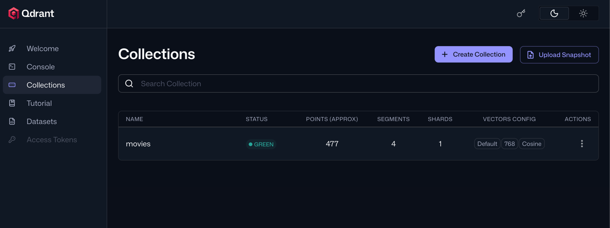

#### 2) `qdrant_points.png` — пример одного фильма в коллекции
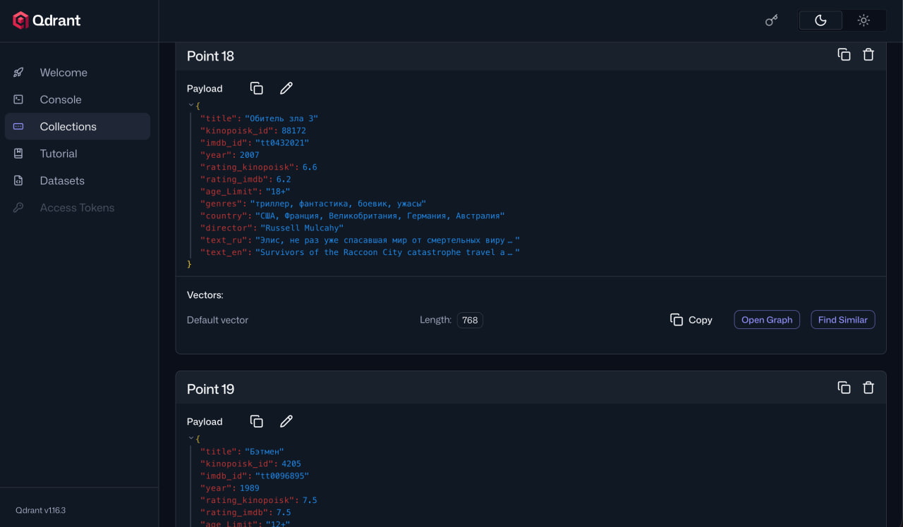

## 3) Архитектура пайплайна

### Схема работы агентов

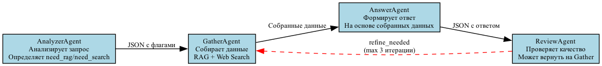 

Пайплайн построен на LangGraph и состоит из 4 агентов, которые выполняются последовательно. Reviewer может вернуть управление на Gatherer (до 3 раз) если ответ недостаточно полный.

### Агенты

Каждый агент реализован как класс с методом `__call__`, принимающий состояние пайплайна и возвращающий обновленное состояние. Агенты инициализируются с необходимыми зависимостями (LLM, инструменты, конфиг) в конструкторе `__init__`.

| Агент | Файл | Промпт | Что делает |
|-------|------|--------|------------|
| **AnalyzerAgent** | `agents/AnalyzerAgent.py` | `ANALYZER_PROMPT` из `agents/prompts.py` | Анализирует запрос пользователя, очищает его от приветствий и вежливых фраз, оставляя только суть по фильмам, и решает: нужен ли RAG (поиск в локальной базе) и/или веб-поиск (Tavily). Возвращает JSON с полями `cleaned_query`, `need_rag`, `need_search`. |
| **GatherAgent** | `agents/GatherAgent.py` | `GATHER_SEARCH_PROMPT` из `agents/prompts.py` | Собирает данные: всегда делает RAG по `effective_query`, и если нужно — веб-поиск по тому же `effective_query`, затем очищает результаты веб-поиска с помощью LLM. |
| **AnswerAgent** | `agents/AnswerAgent.py` | `ANSWER_PROMPT` из `agents/prompts.py` | Формирует финальный ответ на основе собранных данных (RAG + веб). Возвращает JSON с полем `answer`, списком источников и допущениями. Накопляет ответы и возвращает наиболее проработанный (последний). |
| **ReviewAgent** | `agents/ReviewAgent.py` | `REVIEW_PROMPT` из `agents/prompts.py` | Проверяет качество ответа. Если данных мало — возвращает `refine_needed=true` с перефразированным запросом (тот же смысл, другая формулировка). |
### Инструменты (Tools)

| Инструмент | Файл | Описание |
|------------|------|----------|
| `rag_search` | `tools_rag.py` | Поиск по локальной базе фильмов в Qdrant. Эмбеддинги через Ollama. |
| `web_search` | `tools_tavily.py` | Поиск в интернете через Tavily API. |

### Промпты

Все промпты хранятся в файле `agents/prompts.py`:

- `ANALYZER_PROMPT` — инструкции для анализа запроса
- `GATHER_SEARCH_PROMPT` — инструкции для анализа и очистки результатов веб-поиска
- `ANSWER_PROMPT` — инструкции для генерации ответа (включая правило не выдумывать фильмы)
- `REVIEW_PROMPT` — инструкции для проверки качества ответа и перефразировки запроса

### Запуск пайплайна

```bash
cd hw-6
python build_graph.py --config config.yaml --query "Найди фильм про мальчика с волшебными силами"
```

## 4) Логирование в Langfuse

### Инициализация Langfuse (через переменные окружения)

```python
from dotenv import load_dotenv
from langfuse import get_client

# Инициализация Langfuse клиента через переменные окружения
load_dotenv()

langfuse = get_client()
```

Langfuse поддерживает два основных подхода к логированию:

1. **Детальные трейсы по операциям**: Каждый вызов LLM, инструмент или шаг логируется отдельно, что позволяет детально анализировать каждую часть.

2. **Единый трейс пайплайна**: Весь запрос логируется как один большой трейс, внутри которого вложены все операции. Это предпочтительно для оценки общей производительности, последовательности шагов и стоимости запроса.

Используется единый трейс пайплайна, чтобы видеть все операции и общий граф выполнения в одном дереве, а также проще сопоставлять шаги агентов с итоговым ответом.

#### Детальные трейсы

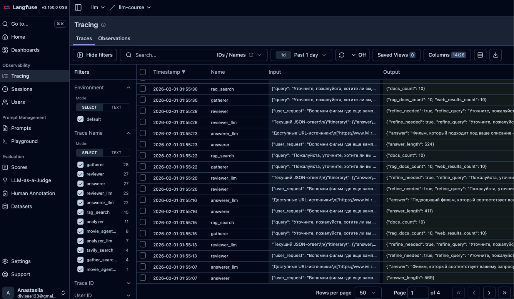

Отображается стоимость токенов, их количество, время работы каждого агента и последовательность вызовов (пример с RAG без уточнений).

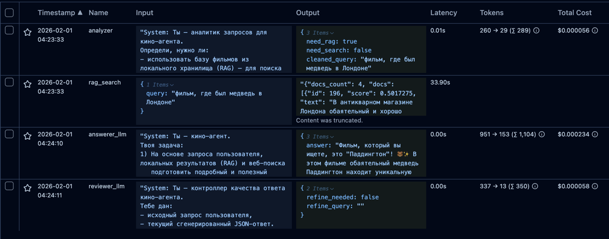


#### Единый трейс пайплайна со всеми операциями

Фиксируем полный пайплайн со всеми операциями и итоговым графом, чтобы видеть цепочку вызовов агентов, инструменты, эмбеддинги и ретривер в одном дереве.

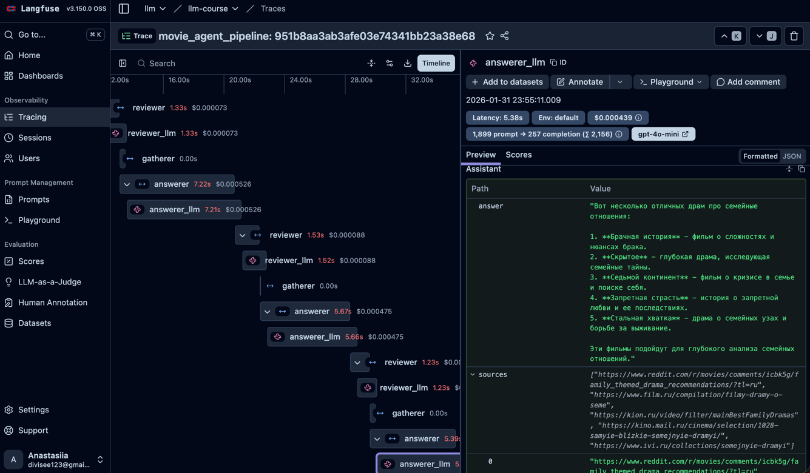

#### Пайплайн без доуточнений (1 итерация)

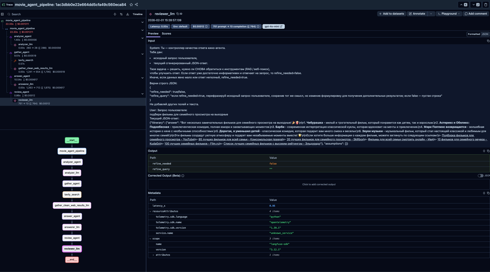

#### Пайплайн с доуточнениями (3 итерации)

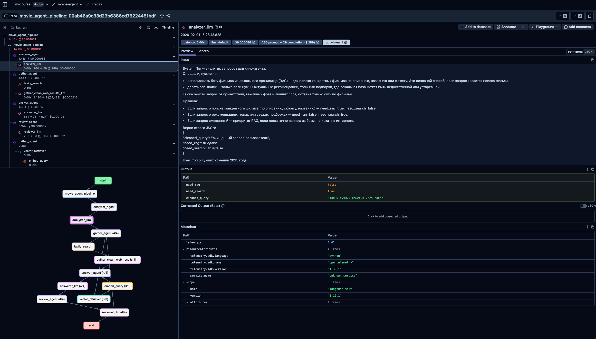

| Тип | Где | Что |
|-----|-----|-----|
| Span (root) | `build_graph.py`, `api.py` | `movie_agent_pipeline` — единый трейс пайплайна |
| Agent | `agents/AnalyzerAgent.py`, `agents/GatherAgent.py`, `agents/AnswerAgent.py`, `agents/ReviewAgent.py` | `analyzer_agent`, `gather_agent`, `answer_agent`, `review_agent` |
| Generation | LLM вызовы агентов | `analyzer_llm`, `gather_clean_web_results_llm`, `answerer_llm`, `reviewer_llm` |
| Tool | `agents/GatherAgent.py` | `tavily_search` — веб-поиск через Tavily |
| Retriever | `agents/GatherAgent.py`, `tools_rag.py` | `vector_retriever` — извлечение из Qdrant |
| Embedding | `tools_rag.py` | `embed_query` — эмбеддинг запроса через Ollama |
| Span (errors) | `agents/AnswerAgent.py`, `agents/ReviewAgent.py` | `answerer_json_error`, `reviewer_json_error` |

## 5) Примеры работы пайплайна

Результаты тестирования (5 запросов, все успешно выполнены):

### Тест 1: RAG — поиск фильма про мальчика с волшебными силами

**Запрос:** "Найди фильм про мальчика с волшебными силами который учится в школе магии"

**Результат:** Пайплайн использовал только RAG (`need_rag=True, need_search=False`), нашёл 10 документов в базе и вернул серию фильмов о Гарри Поттере с описанием первых 4 частей.

### Тест 2: RAG — поиск фильма про ограбление казино

**Запрос:** "Что за фильм где команда грабит три казино в Лас-Вегасе"

**Результат:** Использовался RAG. Reviewer запросил 3 уточняющих итерации, пытаясь найти точный фильм. В итоге предложил "Ограбление по-итальянски" и альтернативные варианты.

### Тест 3: WEB — топ комедий 2025

**Запрос:** "Посоветуй топ 5 лучших комедий 2025 года"

**Результат:** Analyzer определил `need_rag=False, need_search=True`. Tavily вернул 10 результатов. Пайплайн выдал топ-5: Финикийская схема, Счастливчик Гилмор 2, Голый пистолет, Дружба, Обезьяна.

### Тест 4: WEB — фильмы для семейного просмотра

**Запрос:** "Подбери фильмы для семейного просмотра на выходные"

**Результат:** Веб-поиск через Tavily. Ответ получен за одну итерацию без уточнений. Предложены: Чебурашка, Мой сосед Тоторо, Бременские музыканты, Алиса в Стране чудес, Артур, ты король.

### Тест 5: MIXED — драмы про семью

**Запрос:** "Найди хорошие драмы про семейные отношения"

**Результат:** Analyzer выбрал веб-поиск. Reviewer запросил 3 уточняющих итерации (но веб-поиск уже был выполнен, поэтому использовались кэшированные результаты). Итоговый ответ: Брачная история, Скрытое, Седьмой континент, Запретная страсть, Стальная хватка.

### Итоги тестирования

| Тест | Тип | Итерации | Статус |
|------|-----|----------|--------|
| Фильм про мальчика с волшебными силами | RAG | 1 | ✅ |
| Фильм про ограбление казино | RAG | 4 (3 уточнения) | ✅ |
| Топ комедий 2025 | WEB | 4 (3 уточнения) | ✅ |
| Фильмы для семейного просмотра | WEB | 1 | ✅ |
| Драмы про семью | WEB | 4 (3 уточнения) | ✅ |

**Вывод:** Пайплайн корректно определяет тип запроса (RAG/WEB), веб-поиск выполняется максимум 1 раз, уточнения работают до лимита в 3 итерации.

## 6) API сервис и интеграция с Open WebUI

Movie Agent — это **мультиагентная система** на базе LangGraph, состоящая из 4 агентов (Analyzer, Gather, Answer, Review), которые работают совместно для поиска и рекомендации фильмов.

### Запуск API сервиса

```bash
cd hw-6
uvicorn api:app --host 0.0.0.0 --port 8000 --reload
```

Сервис будет доступен по адресу: http://localhost:8000

### Эндпоинты

| Метод | URL | Описание | Пример ответа |
|-------|-----|----------|---------------|
| GET | `/health` | Проверка работоспособности | `{"status":"ok","version":"1.0.0"}` |
| POST | `/query` | Основной запрос к пайплайну | `{"answer":"...","sources":[...],"assumptions":[...],"debug_notes":[...]}` |
| POST | `/v1/chat/completions` | OpenAI-совместимый API для Open WebUI | `{"id":"chatcmpl-movie-agent","object":"chat.completion","model":"movie-agent","choices":[...]}` |
| GET | `/v1/models` | Список моделей для Open WebUI | `{"object":"list","data":[{"id":"movie-agent","object":"model","owned_by":"local","permission":[]}]}` |

### Пример запроса

```bash
curl -X POST http://localhost:8000/query \
  -H "Content-Type: application/json" \
  -d '{"query": "Найди фильм про мальчика с волшебными силами"}'
```

### Интеграция с Open WebUI

1. Откройте Open WebUI: http://localhost:3000
2. Перейдите в **Settings → Connections → OpenAI API**
3. Добавьте новое подключение:
   - **URL:** `http://host.docker.internal:8000/v1` (или `http://localhost:8000/v1` если Open WebUI запущен локально)
   - **API Key:** любой
4. Сохраните и выберите модель `movie-agent` в чате
5. Теперь можно общаться с агентом через интерфейс Open WebUI

### Скриншоты настройки

#### 1) Запуск uvicorn

Команда запуска API сервиса:

```bash
uvicorn api:app --host 0.0.0.0 --port 8000 --reload
```

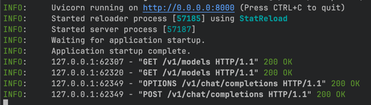

#### 2) Настройка Open WebUI

Настройка подключения к OpenAI API в Open WebUI для общения с агентом через совместимый интерфейс.

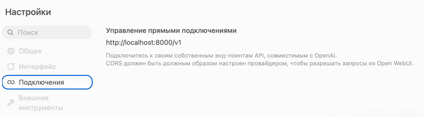

## 7) Эксперименты

### Эксперимент 1: RAG без веб-поиска

Агент использует только локальную базу данных фильмов (RAG) для поиска информации, без обращения к интернету.

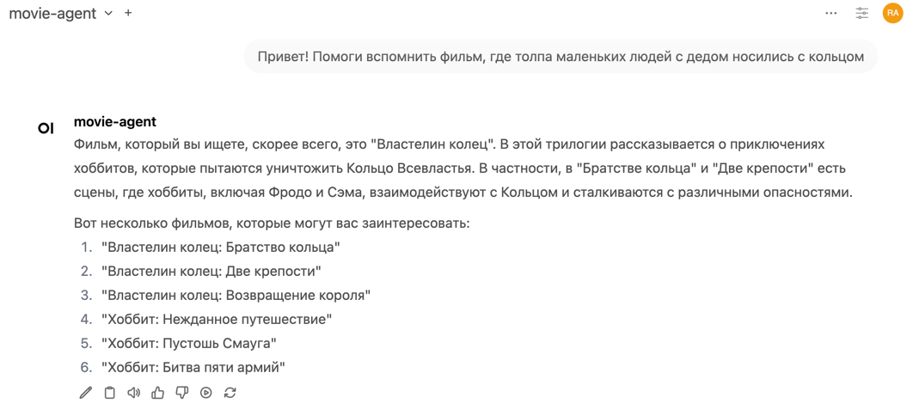 

### Эксперимент 2: С веб-поиском

В этом случае агент выполняет поиск в интернете через Tavily для получения актуальной информации.

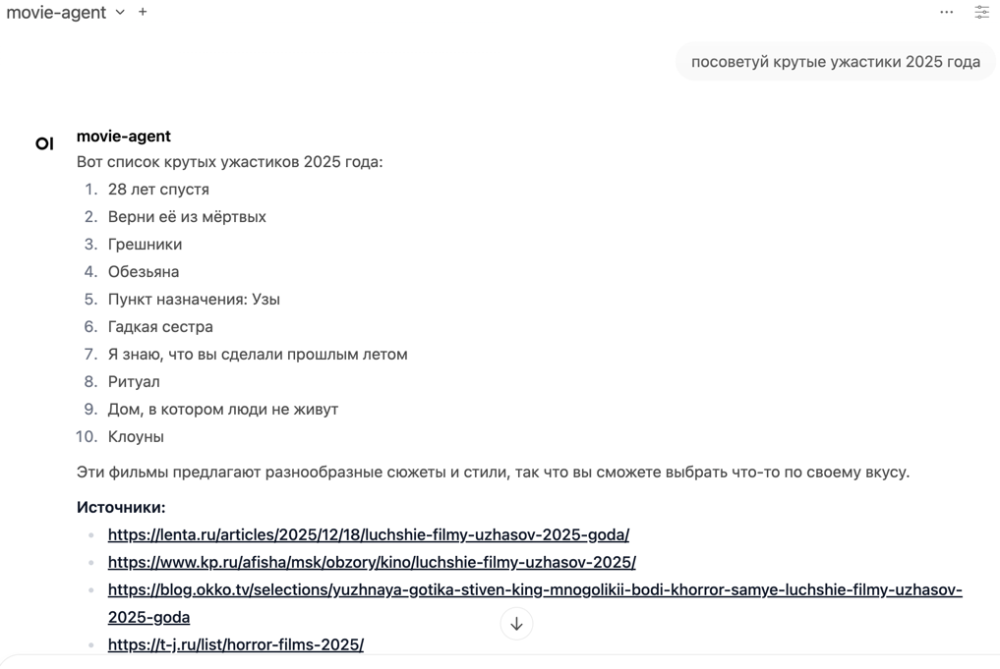


## Аннотации

Аннотации — это ручные метки качества (например, лайк/дизлайк), которые помогают собирать обратную связь, готовить данные для последующей разметки и дообучения, а также быстро оценивать качество ответов и шагов пайплайна.

В этом проекте добавлена аннотация типа boolean `LIKE` (0/1). Пример простановки аннотации:


Оценки можно ставить как из очереди аннотаций, так и прямо из дашборда со списком трейсов. Пример трейсов с оценками:

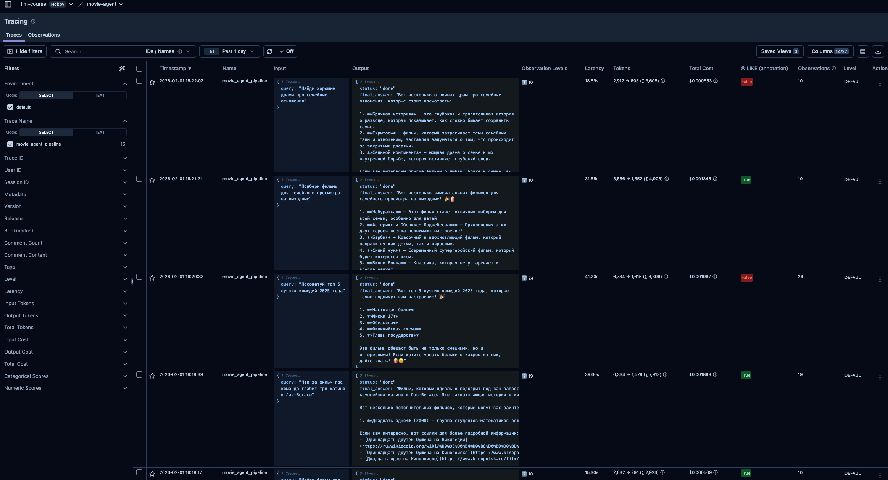

