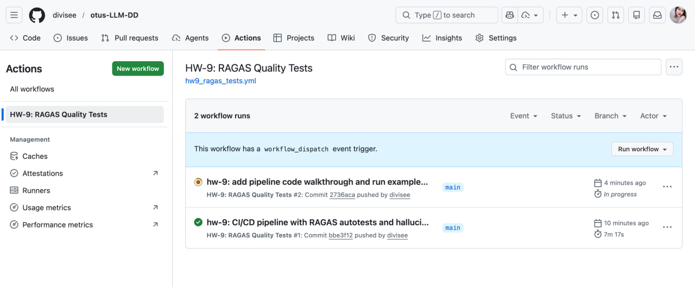
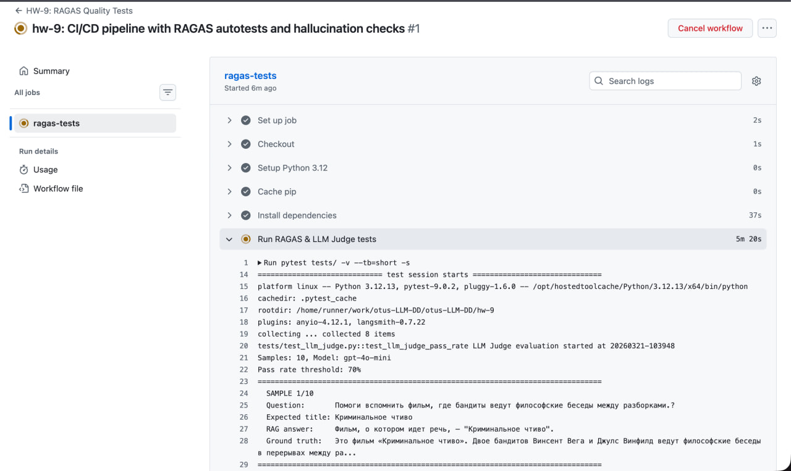
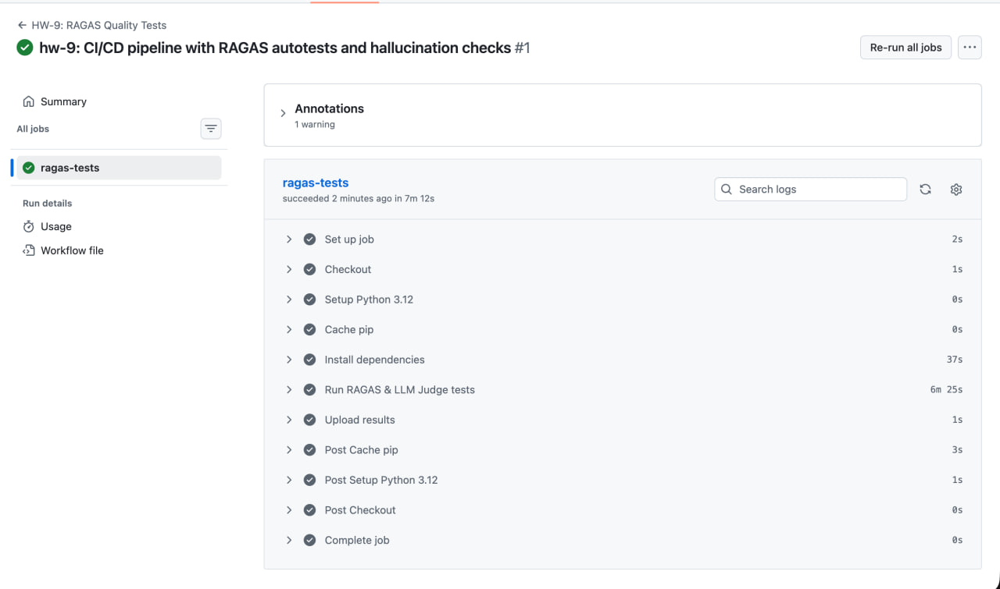

# Отчёт: CI/CD пайплайн с автотестами и проверкой на галлюцинации

## Содержание

- [1) Архитектура проекта](#1-архитектура-проекта)
- [2) RAG-приложение](#2-rag-приложение)
- [3) Золотые примеры (Goldens)](#3-золотые-примеры-goldens)
- [4) Метрики RAGAS и пороговые значения](#4-метрики-ragas-и-пороговые-значения)
- [5) LLM-as-a-Judge](#5-llm-as-a-judge)
- [6) CI/CD пайплайн (GitHub Actions)](#6-cicd-пайплайн-github-actions)
- [7) Локальный запуск](#7-локальный-запуск)
- [8) Интерпретация результатов](#8-интерпретация-результатов)
- [9) Примеры работы (из логов прогона)](#9-примеры-работы-из-логов-прогона)
- [10) Результаты запуска в GitHub Actions](#10-результаты-запуска-в-github-actions)

## 1) Архитектура проекта

```
hw-9/
├── README.md                    # Описание домашнего задания
├── requirements.txt             # Зависимости проекта
├── .env.example                 # Пример переменных окружения
├── .gitignore
├── rag_app.py                   # RAG-приложение для поиска фильмов
├── data/
│   └── movies.csv               # База из 100 фильмов (title, description, question)
├── tests/
│   ├── goldens.json             # 10 золотых примеров для тестирования
│   ├── conftest.py              # Общие pytest-фикстуры (RAG, goldens, результаты)
│   ├── test_ragas_metrics.py    # Тесты RAGAS: 6 метрик (2 жёстких + 4 мягких)
│   └── test_llm_judge.py        # LLM-as-a-Judge + строгая проверка названий
├── results/                     # Результаты прогона (JSON), создаётся при запуске
│   ├── rag_outputs.json         # Ответы RAG на все goldens
│   ├── ragas_results.json       # Метрики RAGAS (средние + per-sample)
│   ├── llm_judge_results.json   # Оценки LLM-судьи
│   └── strict_match_results.json # Результаты строгого совпадения
└── report/
    └── README.md                # Этот отчёт
```

CI/CD конфигурация находится в корне репозитория:

```
.github/workflows/hw9_ragas_tests.yml
```

## 2) RAG-приложение

### Компоненты

| Компонент | Технология | Модель |
|-----------|------------|--------|
| **Embeddings** | OpenAI API | `text-embedding-3-small` |
| **Генерация ответов** | OpenAI API | `gpt-4o-mini` |
| **Векторный поиск** | In-memory (numpy cosine similarity) | — |
| **База знаний** | 100 фильмов из `data/movies.csv` | — |

### Пайплайн

1. **Загрузка базы**: Из CSV загружаются 100 фильмов (название + описание с Кинопоиска).
2. **Эмбеддинги базы**: Для каждого фильма векторизуется строка `"Название. Описание"` через `text-embedding-3-small` — это повышает recall, т.к. название участвует в поиске.
3. **Запрос**: Вопрос пользователя также векторизуется.
4. **Поиск (Retrieve)**: Cosine similarity между вектором вопроса и всеми векторами фильмов, берём **top-10**.
5. **Генерация (Generate)**: LLM (`gpt-4o-mini`) получает top-10 описаний как контекст и формирует ответ.

### Промпт RAG-приложения

**System:**
```
Ты — помощник по поиску фильмов. Тебе даны описания фильмов из базы данных и вопрос пользователя.
Определи, о каком фильме идёт речь, и дай краткий ответ.
Отвечай на основе предоставленного контекста.
Выбери наиболее подходящий фильм из контекста, даже если совпадение частичное.
Обязательно укажи название фильма в ответе.
```

**User:**
```
Контекст:
Фильм: {title_1}
{description_1}
---
Фильм: {title_2}
{description_2}
---
...

Вопрос: {question}
```

Ключевые решения в промпте:
- **«На основе контекста»** — снижает галлюцинации, повышает Faithfulness.
- **«Обязательно укажи название»** — повышает Strict Title Match.
- **«Даже если совпадение частичное»** — модель старается найти лучший вариант, а не отказывается отвечать. Это повышает recall для сложных вопросов (уровень 3-4).

## 3) Золотые примеры (Goldens)

В файле `tests/goldens.json` — 10 тестовых примеров, отобранных из датасета `rag_questions.csv` (100 фильмов, 5 уровней сложности).

Датасет был сгенерирован с помощью LLM в рамках предыдущих домашних заданий и использовался для оценки качества RAG-системы поиска фильмов:
- [hw-5: Langfuse Demo](../../hw-5/report/README.md) — эксперименты с retrieval и LLM-as-a-judge
- [hw-6: Movie Agent](../../hw-6/report/README.md) — полноценная мультиагентная RAG-система, оценка retrieval-метрик на этом датасете

Выборка покрывает разные уровни:

| # | Фильм | Вопрос | Сложность |
|---|-------|--------|-----------|
| 1 | Криминальное чтиво | Помоги вспомнить фильм, где бандиты ведут философские беседы между разборками? | 1 |
| 2 | Бойцовский клуб | Помоги вспомнить фильм, где главный герой страдает бессонницей и встречает харизматичного торговца мылом? | 1 |
| 3 | День сурка | Помоги вспомнить фильм, где главный герой застрял в одном и том же дне? | 1 |
| 4 | Голодные игры | Помоги вспомнить фильм, где юная героиня должна сразиться с другом детства на арене? | 2 |
| 5 | Оппенгеймер | Помоги вспомнить фильм, где главный герой связан с ядерным оружием и Второй мировой войной? | 2 |
| 6 | Форрест Гамп | Помоги вспомнить фильм, где главный герой начал бегать, несмотря на насмешки соседей? | 3 |
| 7 | Мстители: Война бесконечности | Помоги вспомнить фильм, где супергерои объединяются против космического тирана, стремящегося собрать мощные артефакты? | 3 |
| 8 | Три билборда на границе Эббинга, Миссури | Помоги вспомнить фильм, где женщина использует билборды для борьбы с полицией после трагедии? | 3 |
| 9 | Унесённые призраками | Помоги вспомнить фильм, где девочка должна спасти своих родителей от колдуньи в загадочном городе? | 4 |
| 10 | Дюна: Часть вторая | Помоги вспомнить фильм, где герой становится лидером фрименов в борьбе против войны? | 4 |

Каждый golden содержит:
- `question` — вопрос пользователя
- `expected_title` — ожидаемое название фильма
- `ground_truth` — эталонный ответ для RAGAS Context Recall

## 4) Метрики RAGAS и пороговые значения

### Основные метрики (жёсткие пороги — пайплайн падает при нарушении)

| Метрика | Что проверяет | Порог | Обоснование |
|---------|---------------|-------|-------------|
| [**Faithfulness**](https://docs.ragas.io/en/stable/concepts/metrics/available_metrics/faithfulness/) | Галлюцинации: все ли факты в ответе подтверждаются контекстом | ≥ 0.7 | Ответы должны быть основаны на извлечённых документах, не содержать выдуманных фактов |
| [**Context Recall**](https://docs.ragas.io/en/stable/concepts/metrics/available_metrics/context_recall/) | Полнота контекста: содержит ли извлечённый контекст информацию для правильного ответа | ≥ 0.5 | Retrieval должен находить нужный фильм хотя бы в 50% случаев |

### Дополнительные метрики (мягкие пороги — для наблюдения и анализа)

| Метрика | Что проверяет | Порог | Как вычисляется |
|---------|---------------|-------|-----------------|
| [**Context Precision**](https://docs.ragas.io/en/stable/concepts/metrics/available_metrics/context_precision/) | Доля релевантных документов среди извлечённых (нет ли мусора в top-k) | ≥ 0.4 | LLM оценивает, полезен ли каждый извлечённый документ для ответа |
| [**Answer Relevancy**](https://docs.ragas.io/en/stable/concepts/metrics/available_metrics/response_relevancy/) | Насколько ответ релевантен вопросу | ≥ 0.4 | RAGAS генерирует вопросы из ответа, затем сравнивает их эмбеддинги с исходным вопросом |
| [**Factual Correctness**](https://docs.ragas.io/en/stable/concepts/metrics/available_metrics/factual_correctness/) | Фактическая правильность ответа относительно ground truth | ≥ 0.3 | LLM разбивает ответ и ground truth на утверждения, считает TP/FP/FN и F1-score |
| [**Semantic Similarity**](https://docs.ragas.io/en/stable/concepts/metrics/available_metrics/semantic_similarity/) | Семантическое сходство ответа и ground truth | ≥ 0.5 | Cosine similarity эмбеддингов ответа и эталона |

### Схема покрытия RAG-пайплайна метриками

```
Вопрос → [Retrieval] → Контекст → [Generation] → Ответ
              ↑              ↑             ↑            ↑
        Context Recall  Context      Faithfulness  Answer Relevancy
        "Нашли нужное?" Precision    "Не выдумали?" "Ответ по теме?"
                        "Нет мусора?"
                                                   Factual Correctness
                                                   "Факты верны?"

                                                   Semantic Similarity
                                                   "Похож на эталон?"
```

### Как работает оценка RAGAS

RAGAS использует LLM (`gpt-4o-mini`) для оценки метрик. Для каждого примера метрики вызываются поочерёдно через `metric.ascore()` — LLM анализирует ответ, контекст и ground truth, возвращая числовой скор от 0 до 1. Единственная метрика без LLM — Semantic Similarity, которая считает cosine similarity эмбеддингов.

Пример вызова (из `test_ragas_metrics.py`):

```python
from openai import AsyncOpenAI
from ragas.llms import llm_factory
from ragas.metrics.collections import Faithfulness

client = AsyncOpenAI()
llm = llm_factory("gpt-4o-mini", client=client)
scorer = Faithfulness(llm=llm)

result = await scorer.ascore(
    user_input="Помоги вспомнить фильм, где бандиты ведут философские беседы?",
    response="Это фильм «Криминальное чтиво» (1994) Квентина Тарантино.",
    retrieved_contexts=["Криминальное чтиво — фильм 1994 года..."]
)
print(result.value)  # 1.0
```

### Как использовать в CI/CD

Жёсткие пороги задаются в `tests/test_ragas_metrics.py` в словаре `THRESHOLDS`, мягкие — в `SOFT_THRESHOLDS`. При изменении модели или промптов можно скорректировать пороги. Если основные метрики ниже жёстких порогов — тест падает, пайплайн помечается как FAILED. Мягкие пороги предназначены для наблюдения: если метрика недоступна в текущей версии RAGAS, тест автоматически пропускается (`pytest.skip`).

## 5) LLM-as-a-Judge

### Модель-судья

Модель `gpt-4o-mini` (temperature=0) выступает судьёй: для каждого golden-примера она получает вопрос, ожидаемый фильм и ответ системы, и оценивает, правильно ли определён фильм.

### Промпт судьи

**System:**
```
Ты — строгий судья качества ответов системы поиска фильмов.
Оцени, правильно ли система определила фильм.
Верни ТОЛЬКО JSON с полями: "correct" (true/false) и "explanation" (краткое обоснование до 30 слов).
```

**User:**
```
Вопрос пользователя: {question}
Ожидаемый фильм: {expected_title}
Ответ системы: {answer}

Критерии:
- correct=true если в ответе упоминается правильный фильм
  (допускаются небольшие вариации в названии)
- correct=false если фильм не угадан или назван другой
```

**Пример ответа судьи:**
```json
{
  "correct": true,
  "explanation": "Ответ правильно определяет фильм «Криминальное чтиво»"
}
```

### Пороги

| Тест | Порог | Описание |
|------|-------|----------|
| **LLM Judge Pass Rate** | ≥ 70% | Доля ответов, где модель-судья подтверждает правильность |
| **Strict Title Match** | ≥ 60% | Доля ответов, содержащих точное название ожидаемого фильма |

## 6) CI/CD пайплайн (GitHub Actions)

### Файл: `.github/workflows/hw9_ragas_tests.yml`

```yaml
name: "HW-9: RAGAS Quality Tests"    # Название workflow (видно во вкладке Actions)

on:                                   # Триггеры запуска:
  push:
    paths: ["hw-9/**"]                #   — push в файлы hw-9/
  pull_request:
    paths: ["hw-9/**"]                #   — PR с изменениями в hw-9/
  workflow_dispatch:                   #   — ручной запуск через UI GitHub

jobs:
  ragas-tests:
    runs-on: ubuntu-latest            # Виртуальная машина Ubuntu в облаке GitHub
    timeout-minutes: 15               # Таймаут — если тесты зависнут, job упадёт через 15 мин

    defaults:
      run:
        working-directory: hw-9       # Все команды run выполняются из папки hw-9/

    steps:
      - name: Checkout                # 1. Клонирование репозитория
        uses: actions/checkout@v4

      - name: Setup Python 3.12      # 2. Установка Python
        uses: actions/setup-python@v5
        with:
          python-version: "3.12"

      - name: Cache pip               # 3. Кэширование pip-пакетов (ускоряет повторные запуски)
        uses: actions/cache@v4
        with:
          path: ~/.cache/pip
          key: ${{ runner.os }}-pip-${{ hashFiles('hw-9/requirements.txt') }}
          restore-keys: ${{ runner.os }}-pip-

      - name: Install dependencies    # 4. Установка зависимостей
        run: pip install -r requirements.txt

      - name: Run RAGAS & LLM Judge tests  # 5. Запуск тестов
        env:                          # Переменные окружения (секрет + модели)
          OPENAI_API_KEY: ${{ secrets.OPENAI_API_KEY }}
          OPENAI_MODEL: gpt-4o-mini
          OPENAI_EMBED_MODEL: text-embedding-3-small
        run: pytest tests/ -v --tb=short -s

      - name: Upload results          # 6. Загрузка артефактов (даже если тесты упали)
        if: always()
        uses: actions/upload-artifact@v4
        with:
          name: hw9-test-results
          path: hw-9/results/
          if-no-files-found: ignore
```

### Разбор по шагам

| # | Step | Что делает | Зачем |
|---|------|-----------|-------|
| 1 | **Checkout** | `git clone` репозитория | Получить код на runner |
| 2 | **Setup Python** | Устанавливает Python 3.12 | Окружение для запуска тестов |
| 3 | **Cache pip** | Сохраняет/восстанавливает `~/.cache/pip` | Ускоряет `pip install` при повторных запусках (если `requirements.txt` не менялся) |
| 4 | **Install dependencies** | `pip install -r requirements.txt` | Устанавливает ragas, openai, pytest и т.д. |
| 5 | **Run tests** | `pytest tests/ -v --tb=short -s` | Запускает все тесты; `-v` — подробный вывод, `-s` — показывать print, `--tb=short` — короткие трейсбеки |
| 6 | **Upload results** | Загружает `results/` как артефакт | Можно скачать JSON с метриками после прогона; `if: always()` — загружает даже если тесты упали |

**Ключевые моменты:**
- `${{ secrets.OPENAI_API_KEY }}` — GitHub подставляет секрет из Settings, в логах он маскируется как `***`
- `timeout-minutes: 15` — защита от зависания (RAGAS-оценка 10 примеров занимает ~7 мин)
- `if: always()` на Upload — артефакты сохраняются даже при FAIL, чтобы можно было проанализировать, какие метрики упали

### Jobs (обзор)

```
ragas-tests (ubuntu-latest, Python 3.12)
├── Checkout
├── Setup Python 3.12
├── Cache pip
├── Install dependencies (pip install -r requirements.txt)
├── Run RAGAS & LLM Judge tests (pytest tests/ -v)
└── Upload results (artifact: hw9-test-results)
```

### Quality Gates

Пайплайн **падает** (`exit code 1`), если нарушен хотя бы один жёсткий порог:

| Quality Gate | Порог | Тип |
|---|---|---|
| Faithfulness | < 0.7 | Жёсткий |
| Context Recall | < 0.5 | Жёсткий |
| Context Precision | < 0.4 | Мягкий |
| Answer Relevancy | < 0.4 | Мягкий |
| Factual Correctness | < 0.3 | Мягкий |
| Semantic Similarity | < 0.5 | Мягкий |
| LLM Judge Pass Rate | < 70% | Жёсткий |
| Strict Title Match | < 60% | Жёсткий |

Мягкие quality gates тоже роняют пайплайн, но с заниженными порогами — они предназначены скорее для наблюдения. Если метрика недоступна в текущей версии RAGAS, соответствующий тест пропускается.

### Секреты

Для работы пайплайна необходимо добавить секрет в GitHub:

| Секрет | Описание | Где получить |
|--------|----------|--------------|
| `OPENAI_API_KEY` | API ключ OpenAI | https://platform.openai.com/api-keys |

### Настройка секрета

1. Перейти в репозиторий на GitHub.
2. **Settings → Secrets and variables → Actions → New repository secret**.
3. Name: `OPENAI_API_KEY`, Value: ваш ключ `sk-...`.

### Как запустить пайплайн

**Автоматически** — пайплайн запускается сам при:
- Push коммита, затрагивающего файлы в `hw-9/`
- Открытии Pull Request с изменениями в `hw-9/`

**Вручную (workflow_dispatch):**

1. Перейти в репозиторий на GitHub.
2. Вкладка **Actions** (в верхнем меню, рядом с Pull requests).
3. Слева в списке workflows выбрать **HW-9: RAGAS Quality Tests**.
4. Справа нажать кнопку **Run workflow**.
5. Выбрать ветку (по умолчанию `main`) и нажать зелёную кнопку **Run workflow**.
6. Дождаться завершения — статус виден на этой же странице (зелёная галочка = PASS, красный крестик = FAIL).
7. Нажать на прогон → раздел **Artifacts** внизу → скачать `hw9-test-results` с JSON-результатами.

### Артефакты

После каждого прогона сохраняются артефакты (`hw9-test-results`):
- `rag_outputs.json` — ответы RAG на все goldens
- `ragas_results.json` — метрики RAGAS
- `llm_judge_results.json` — оценки модели-судьи
- `strict_match_results.json` — строгое совпадение названий

Артефакты доступны на странице workflow run в GitHub.

## 7) Локальный запуск

### Предварительные требования

- Python 3.10+
- API ключ OpenAI

### Установка

```bash
cd hw-9
pip install -r requirements.txt
```

### Настройка ключа

```bash
cp .env.example .env
# Отредактируйте .env, вставив свой OPENAI_API_KEY
```

Или через переменную окружения:

```bash
export OPENAI_API_KEY=sk-your-key-here
```

### Запуск RAG-приложения (интерактивно)

```bash
python rag_app.py
```

### Запуск тестов

```bash
pytest tests/ -v -s
```

### Примерное время выполнения

- Эмбеддинги базы (100 фильмов): ~2 сек
- 10 RAG-запросов: ~15 сек
- RAGAS оценка (10 примеров, 6 метрик): ~1-2 мин
- LLM Judge (10 примеров): ~10 сек
- **Итого: ~2-3 минуты**

### Примерная стоимость

- Эмбеддинги базы: ~$0.001 (text-embedding-3-small: $0.02/1M токенов)
- Генерация ответов (10 запросов): ~$0.005 (gpt-4o-mini: $0.15/1M input)
- RAGAS оценка (6 метрик, 10 примеров): ~$0.02
- LLM Judge (10 примеров): ~$0.003
- **Итого за прогон: ~$0.03**

## 8) Интерпретация результатов

### Faithfulness (проверка на галлюцинации)

- **Высокий (> 0.8)**: Ответы хорошо основаны на контексте, минимум галлюцинаций.
- **Средний (0.5-0.8)**: Некоторые ответы содержат информацию не из контекста.
- **Низкий (< 0.5)**: Модель часто галлюцинирует — нужно улучшить промпт или модель.

### Context Recall (полнота извлечения)

- **Высокий (> 0.7)**: Retrieval находит нужные документы.
- **Средний (0.3-0.7)**: Часть запросов не находит правильный фильм — нужно улучшить эмбеддинги или базу.
- **Низкий (< 0.3)**: Серьёзные проблемы с retrieval.

### Context Precision (точность извлечения)

- **Высокий (> 0.7)**: Почти все извлечённые документы релевантны — мало шума.
- **Средний (0.4-0.7)**: Часть документов в top-k нерелевантны.
- **Низкий (< 0.4)**: Много мусора в результатах поиска, нужно настраивать score_threshold или top_k.

### Answer Relevancy (релевантность ответа)

- **Высокий (> 0.7)**: Ответ чётко отвечает на заданный вопрос.
- **Средний (0.4-0.7)**: Ответ частично отклоняется от темы вопроса.
- **Низкий (< 0.4)**: Ответ не соответствует вопросу — проблема в генерации.

### Factual Correctness (правильность ответа)

- **Высокий (> 0.7)**: Факты в ответе совпадают с эталоном.
- **Средний (0.3-0.7)**: Ответ частично верен — есть пропущенные или лишние факты.
- **Низкий (< 0.3)**: Ответ фактически неверен.

### Semantic Similarity (семантическое сходство)

- **Высокий (> 0.8)**: Ответ семантически очень похож на эталон.
- **Средний (0.5-0.8)**: Смысл передан, но формулировки отличаются.
- **Низкий (< 0.5)**: Ответ далёк от эталона по смыслу.

### LLM Judge

- **Pass Rate > 80%**: Система хорошо определяет фильмы.
- **Pass Rate 60-80%**: Приемлемо, но есть пространство для улучшения.
- **Pass Rate < 60%**: Нужно пересмотреть RAG-пайплайн.

## 9) Примеры работы (из логов прогона)

### Сводные результаты

```
=== RAGAS Results (averages) ===
  faithfulness             : 0.7000  (порог HARD: 0.7)  [PASS]
  context_recall           : 0.7000  (порог HARD: 0.5)  [PASS]
  context_precision        : 0.4278  (порог soft: 0.4)  [PASS]
  factual_correctness      : 0.3990  (порог soft: 0.3)  [PASS]

=== LLM Judge Summary ===
  Pass rate: 80% (8/10)   [PASS]

=== Strict Match Summary ===
  Match rate: 80% (8/10)  [PASS]
```

### Пример 1: Правильный ответ (Криминальное чтиво, сложность 1)

Вопрос лёгкий — описание фильма очевидно. RAG находит нужный фильм, все метрики максимальны.

```
SAMPLE 1/10
  Question:     Помоги вспомнить фильм, где бандиты ведут философские беседы между разборками?
  Answer:       Фильм, о котором идет речь, — "Криминальное чтиво".
  Ground Truth: Это фильм «Криминальное чтиво». Двое бандитов Винсент Вега и Джулс Винфилд
                ведут философские беседы в перерывах между разборками...

  RAGAS:
    faithfulness       = 1.0   (ответ полностью основан на контексте)
    context_recall     = 1.0   (нужный фильм в top-10)
    context_precision  = 1.0   (релевантный документ на 1-м месте)
    factual_correctness = 0.4  (ответ краток, ground truth подробнее)

  LLM Judge: [CORRECT]
    "Фильм 'Криминальное чтиво' действительно содержит философские беседы
     между бандитами, что соответствует запросу пользователя."

  Strict Match: [MATCH] — "Криминальное чтиво" найдено в ответе
```

**Анализ:** Faithfulness = 1.0, потому что ответ не содержит выдуманных фактов. Context Recall = 1.0 — retrieval нашёл нужный фильм. Factual Correctness = 0.4 — ответ верный, но слишком краткий по сравнению с подробным ground truth (метрика считает F1 по утверждениям).

### Пример 2: Неправильный ответ (Голодные игры, сложность 2)

Вопрос сложнее — RAG путает «Голодные игры» с «Алисой в Пограничье» (похожие темы: арена, выживание).

```
SAMPLE 4/10
  Question:     Помоги вспомнить фильм, где юная героиня должна сразиться
                с другом детства на арене?
  Answer:       Фильм, который вы ищете, — "Алиса в Пограничье".
  Ground Truth: Это фильм «Голодные игры». Юная Китнисс и тайно влюблённый
                в неё Пит участвуют в показательных играх на выживание.

  RAGAS:
    faithfulness       = 1.0   (ответ основан на контексте — но на НЕПРАВИЛЬНОМ!)
    context_recall     = 0.0   (фильм "Голодные игры" НЕ попал в top-10)
    context_precision  = 0.0   (ни один документ не содержит нужную информацию)
    factual_correctness = 0.0  (ответ фактически неверен)

  LLM Judge: [WRONG]
    "Ответ системы не соответствует ожидаемому фильму 'Голодные игры',
     так как 'Алиса в Пограничье' не имеет такой сюжетной линии."

  Strict Match: [MISS] — "Голодные игры" не найдено в ответе
```

**Анализ:** Faithfulness = 1.0, хотя ответ **неправильный** — это ключевой нюанс метрики. Faithfulness проверяет, не галлюцинирует ли модель *относительно контекста*, а не правильность ответа. Модель ответила на основе того, что ей дали (Алиса в Пограничье была в контексте). Проблема в **retrieval**: Context Recall = 0.0, фильм «Голодные игры» просто не попал в top-10.

### Пример 3: Частично правильный ответ (Дюна: Часть вторая, сложность 4)

RAG нашёл «Дюна», но не «Дюна: Часть вторая» — строгое совпадение не проходит.

```
SAMPLE 10/10
  Question:     Помоги вспомнить фильм, где герой становится лидером
                фрименов в борьбе против войны?
  Answer:       Фильм, о котором идет речь, это "Дюна".
  Ground Truth: Это фильм «Дюна: Часть вторая». Герцог Пол Атрейдес
                присоединяется к фрименам, чтобы стать Муад Дибом...

  RAGAS:
    faithfulness       = 0.0   (ответ не подтверждается контекстом — "Дюна" без уточнения)
    context_recall     = 0.0   (конкретно "Часть вторая" не найдена в контексте)
    context_precision  = 0.0
    factual_correctness = 0.33

  LLM Judge: [WRONG]
    "Ответ не соответствует ожидаемому фильму, так как не упоминается
     'Дюна: Часть вторая', а только 'Дюна'."

  Strict Match: [MISS] — "Дюна: Часть вторая" не найдено в ответе
```

**Анализ:** RAG нашёл похожий фильм, но не тот. Это типичная ошибка для фильмов-сиквелов с похожими названиями и описаниями. LLM Judge строго различает «Дюна» и «Дюна: Часть вторая».

## 10) Результаты запуска в GitHub Actions

### Список пайплайнов



### Процесс выполнения



### Результат — проверки пройдены



### Возможные улучшения

- Увеличить базу фильмов (с 100 до 1000+).
- Использовать более мощную модель эмбеддингов.
- Добавить re-ranking (перетасовку результатов).
- Увеличить top_k или добавить hybrid search.
- Расширить набор goldens до 50-100 примеров.
