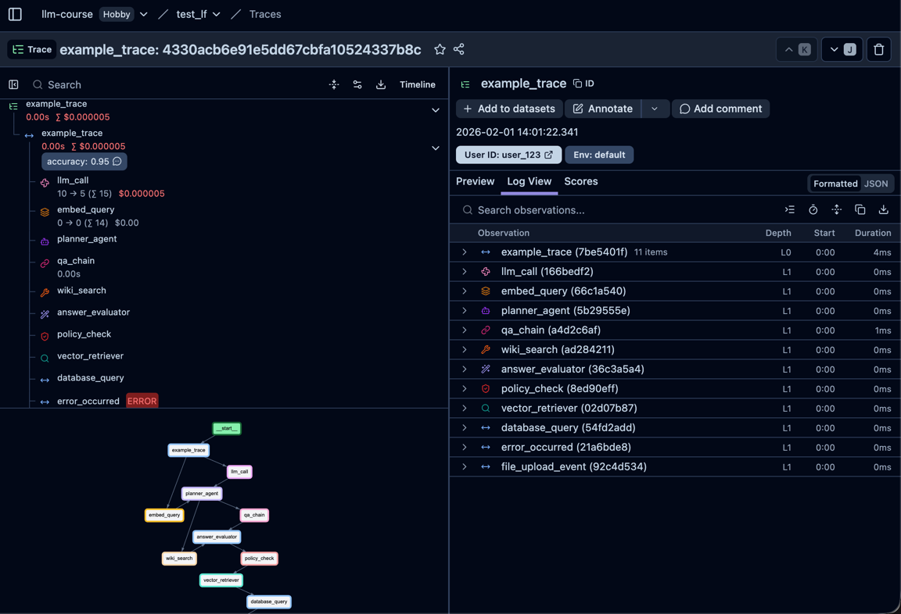

# Langfuse Demo

Демо-папка с тремя экспериментами по трассировке в Langfuse: полный набор типов наблюдений, запуск через декоратор и ручное логирование без декоратора.

## Настройка

1. Установите зависимости:

   ```bash
   pip install -r requirements.txt
   ```

2. Создайте файл `langfuse-demo/.env` и заполните переменные окружения:

   ```dotenv
   LANGFUSE_SECRET_KEY=sk-lf-...
   LANGFUSE_PUBLIC_KEY=pk-lf-...
   LANGFUSE_BASE_URL=https://cloud.langfuse.com
   ```

3. Запустите нужный эксперимент:

   ```bash
   python demo.py
   python demo_observe.py
   ```
Общий список трейсов после запуска экспериментов:


## Эксперимент 1: полный набор типов наблюдений

Файл: `langfuse-demo/demo.py`

Сценарий создает один root span и вложенные наблюдения всех доступных типов, включая generation, embedding, agent, tool, retriever, guardrail и ошибки. Скриншот показывает развернутый трейс с таймлайном и статусами.



## Эксперимент 2: декоратор @observe

Файл: `langfuse-demo/demo_observe.py`

Сценарий демонстрирует трассировку функций через декоратор `@observe`. Трейс формируется автоматически, а вложенные шаги попадают в дерево.

Пример кода:

```python
from langfuse import observe

@observe(name="process_data_decorated")
def process_data_decorated(data):
    result1 = step_one_decorated(data)
    result2 = step_two_decorated(result1)
    return {"final_result": result2}

@observe(name="step_one_decorated")
def step_one_decorated(data):
    return {**data, "step_one_processed": True}

@observe(name="step_two_decorated")
def step_two_decorated(data):
    return {**data, "step_two_processed": True}
```


## Эксперимент 3: ручное логирование без декоратора

Файл: `langfuse-demo/demo_observe.py`

Сценарий строит трейс вручную через `start_as_current_observation` и `update`. На скриншоте видно два шага, вложенные в root span.

Пример кода:

```python
def process_data_manual(data, trace_name, langfuse):
    with langfuse.start_as_current_observation(
        as_type="span",
        name=trace_name,
        input=data,
    ) as root_span:
        result1 = step_one_manual(data, langfuse)
        result2 = step_two_manual(result1, langfuse)
        root_span.update(output={"final_result": result2})
        return {"final_result": result2}

def step_one_manual(data, langfuse):
    with langfuse.start_as_current_observation(
        as_type="span",
        name="step_one_manual",
        input=data,
    ) as span:
        output = {**data, "step_one_processed": True}
        span.update(output=output)
        return output

def step_two_manual(data, langfuse):
    with langfuse.start_as_current_observation(
        as_type="span",
        name="step_two_manual",
        input=data,
    ) as span:
        output = {**data, "step_two_processed": True}
        span.update(output=output)
        return output
```


## Вывод

Наиболее информативным выглядит `example_trace`, потому что в одном трейсе показаны все ключевые типы наблюдений (generation, embedding, agent, tool, retriever, guardrail), есть успешные и ошибочные ветки, а также таймлайн по шагам. Это дает наиболее полную картину поведения пайплайна и структуры трассировки по сравнению с минимальными сценариями.

## Примечания

- `get_client()` использует переменные окружения `LANGFUSE_*`.
- Для короткоживущих скриптов важно вызывать `flush()` и `shutdown()`.

См. результаты в дашборде Langfuse: https://cloud.langfuse.com
